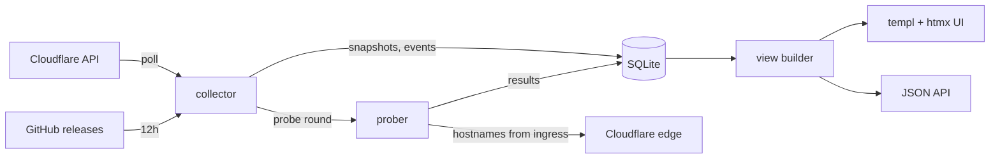

# Architecture

```
cmd/cftm            entry point: logging, config, store, goroutines, HTTP server
internal/
  cloudflare        read-only Cloudflare API client
  collector         poll loop, health signals, events, audit, probe scheduling
  prober            end-to-end HTTP checks and result classification
  release           latest cloudflared version from the GitHub API
  store             SQLite persistence, status history, uptime
  server            routes, middleware, view builders, JSON API
  web               templ components, Tailwind stylesheet, vendored JavaScript
  config            environment configuration
  logbuf            in-memory ring buffer of recent log records
  version           build metadata injected via -ldflags
```

## Data flow



The collector only writes; the HTTP layer only reads. Nothing is cached in
memory between requests apart from the collector's own status, so a page always
reflects what is actually in the database.

## Why the API is the only source

Every tunnel in the target environment is created with
`config_src = "cloudflare"`, so there is no `config.yml` on any host to read.
`cloudflared` also runs as a systemd unit without the `--metrics` flag, which
means its Prometheus endpoint is bound to an ephemeral loopback port and is not
reachable. The Cloudflare API is therefore the only available source.

## Endpoints used

| Endpoint | Purpose |
| --- | --- |
| `GET /accounts/{id}/cfd_tunnel` | Status and edge connections of every tunnel |
| `GET /accounts/{id}/cfd_tunnel/{tid}/connections` | Connector version, architecture, config version |
| `GET /accounts/{id}/cfd_tunnel/{tid}/configurations` | Ingress rules |
| `GET /accounts/{id}/access/apps` | Access applications |
| `GET /accounts/{id}/access/apps/{id}/policies` | Policies per application |
| `GET /accounts/{id}/access/service_tokens` | Service token metadata |
| `GET /accounts/{id}/access/logs/access_requests` | Access authentication log |
| `GET /zones?account.id={id}` | Which zone serves a hostname |
| `POST /graphql` | Request origins by country |

The tunnel list already embeds `connections[]`, so status, data center and
origin IP cost no extra request.

## The GraphQL Analytics API

Request origins need a second API. The REST endpoints carry no country, and the
Access logs miss traffic entirely when a **bypass** policy is in play: bypass
disables every Access control and Cloudflare does not record those requests as
Access events. Only the zone-scoped `httpRequestsAdaptiveGroups` dataset sees
them.

Three things differ from the REST client and are worth knowing:

- It is a **POST**, and errors arrive as **HTTP 200** with a populated `errors`
  array, so the status code says nothing. A missing permission is recognised by
  `extensions.code == "authz"` rather than by matching message text.
- It has its **own quota**, 300 queries per five minutes, counted separately
  from the REST budget. The client tracks the two independently so an analytics
  query cannot eat into the reserve that protects the Terraform pipeline.
- The datasets are **adaptively sampled**. Counts become estimates as volume
  grows, and how far back a query may reach depends on the plan. Both are read
  from the API rather than assumed: the window is shortened to what the plan
  allows, and estimated figures are labelled instead of scaled up.

Only aggregated country codes are stored. Client IP addresses are personal data
and answer no question the country does not.

## API budget

Cloudflare permits 1200 requests per five minutes per user, counted
cumulatively across the dashboard, API keys and every token.

| Source | Requests per 5 min | Share |
| --- | --- | --- |
| Poll cycle at 30s (1 list + 3 connections) | 40 | 3.3 % |
| Ingress configuration, on drift or every 10th cycle | 3 | 0.3 % |
| Access audit, hourly burst | 41 | 3.4 % |
| Request origins, hourly, one zone list plus a query per zone | 3 | 0.3 % |
| **Total, steady state / with audit burst** | **~44 / ~85** | **3.7 % / 7 %** |

The client parses the `Ratelimit` response header, stores the remaining quota
and refuses to send once a reserve of 100 requests is left, so a misbehaving
monitor cannot lock the Terraform pipeline out. A `429` is never retried; the
five-minute block is recorded and subsequent calls short-circuit until it
expires.

## Health signals

The Cloudflare status field is only the starting point. `collector.Evaluate` is
a pure function over one tunnel's snapshot and derives:

| Code | Severity | Trigger |
| --- | --- | --- |
| `tunnel_down` | critical | No connection to the edge |
| `tunnel_degraded` | warning | Serving traffic but unhealthy |
| `tunnel_inactive` | info | Never been run |
| `no_connectors` | critical | No `cloudflared` registered |
| `low_ha_connections` | warning | Fewer than four QUIC connections |
| `single_colo` | warning | All connections in one data center, no failover |
| `version_drift` | warning | Connector older than the newest release |
| `config_drift` | warning | Connector applied an older configuration version |
| `flapping` | warning | More than four status changes in an hour |
| `ingress_no_tls_verify` | info | `noTLSVerify` on an ingress rule |
| `ingress_localhost_origin` | warning | Origin uses `localhost`; `cloudflared` tries `::1` first |
| `access_unprotected` | warning | Public hostname without an Access application, unless declared in `CFTM_EXPECTED_PUBLIC` |
| `access_bypass` | warning | Access application waives enforcement, so nothing is checked and nothing is logged |
| `service_token_expiring` | warning/critical | Service token expires within 30 days |
| `no_cloudflare_alert` | info | No Cloudflare notification policy would fire for the tunnel |

Being pure, it is exercised directly by unit tests and reused by the UI without
a second code path.

## Uptime and heartbeats

The status history table stores one row per **transition**, not per poll, so a
month of history is a handful of rows. Uptime is the integral of the healthy
intervals over the window, clamped to the first observation so a tunnel added
minutes ago does not report a near-zero 30-day figure.

The heartbeat bar splits the last 24 hours into 48 buckets and renders the
**worst** status seen in each, so a five-minute outage stays visible instead of
being averaged away.

## HTTP quality history

Probe history is queried through the existing `(hostname, checked_at)` index
for the selected hostname in `(now - 24h, now]`. The server validates selection
against the tunnel's probeable ingress hostnames, computes statistics from raw
samples and emits bounded, server-rendered SVG geometry. No chart library,
external JavaScript, new database schema or extra Cloudflare API call is needed.

`GET /partials/tunnels/{id}/quality?hostname=...` refreshes only this panel.
The same selection works on the tunnel page and `GET /api/tunnels/{id}`; the
JSON `quality` object exposes counts, timestamps and nullable statistics.
Missing statistics are `null`, not zero. Access/cache observations remain
visible as excluded markers without inflating either success or failure rates.

## Security

- No built-in authentication; Cloudflare Access is the gate. The dashboard
  exposes tunnel configuration and origin IPs, so do not publish it directly.
- Content-Security-Policy keeps `script-src 'self'`. All JavaScript is
  vendored, no CDN.
- `http.CrossOriginProtection` guards the two POST endpoints via
  `Sec-Fetch-Site` and `Origin`, so no per-form tokens are needed.
- Probes never follow redirects, only request `/`, only target hostnames from
  the ingress inventory and cap the response body at 8 KiB.
- Service token secrets are redacted from probe error messages and are never
  serialized into the API or the UI.
- Request paths are stripped of control characters before logging.
